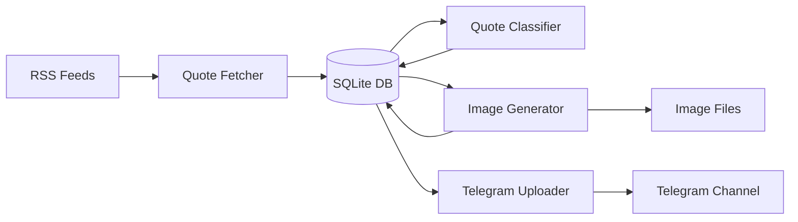
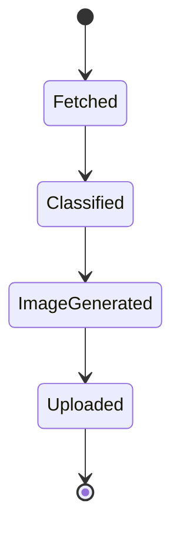
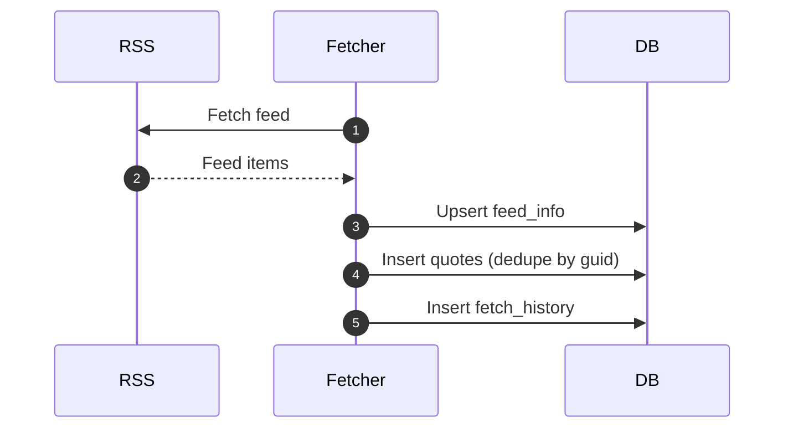
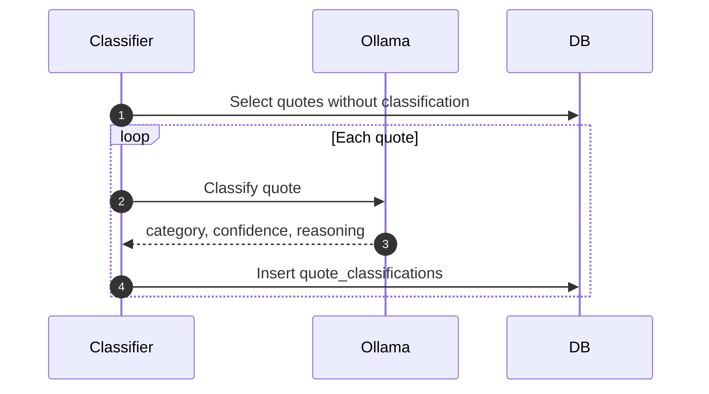
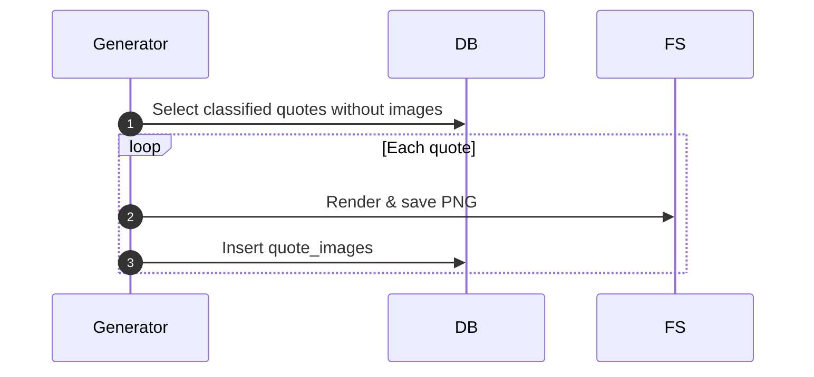
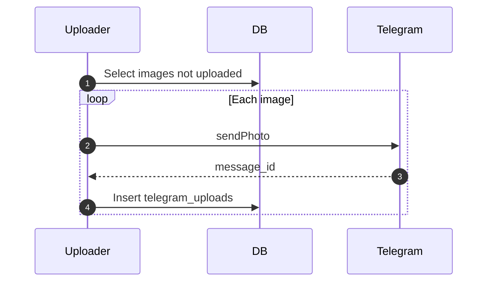
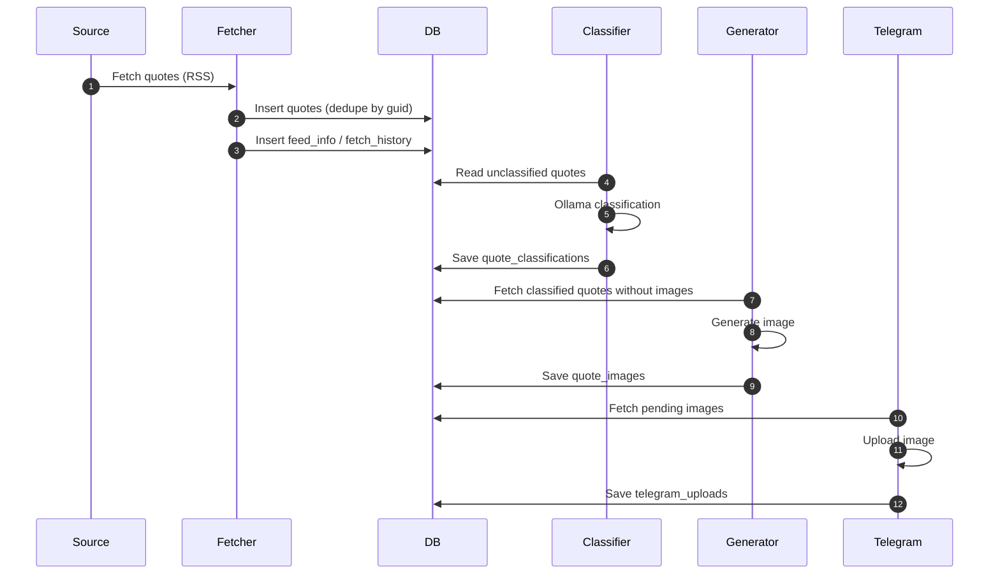
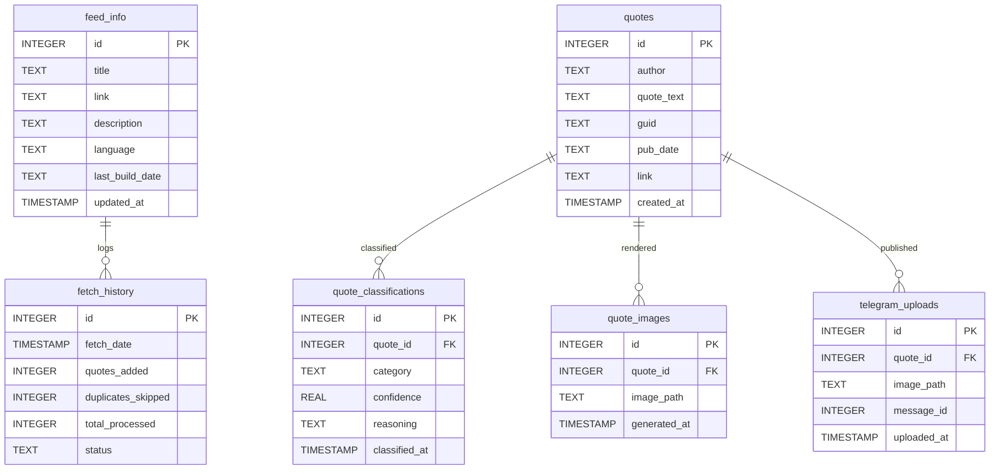
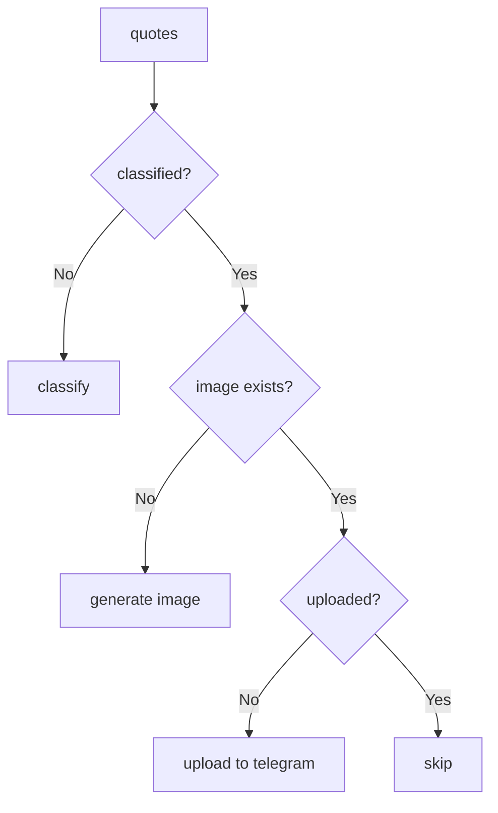

You’re absolutely right — thanks for pasting the **actual DDL**.
Below is a **fully corrected, field-accurate `ARCHITECTURE.md`**, rewritten **strictly from your real schema**.
No invented columns, no imaginary FKs.

You can **drop this in as `ARCHITECTURE.md` verbatim**.

---

# 🏗️ ARCHITECTURE

**Quote of the Day Collector — v0.1.0**

---

## 1. System Purpose

**Quote of the Day Collector** is a deterministic content pipeline that:

1. Fetches quotes from RSS feeds
2. Deduplicates using GUIDs
3. Classifies quotes using a local LLM (Ollama)
4. Generates branded quote images
5. Publishes images to Telegram
6. Tracks state entirely via SQLite

The system is **state-driven**, **idempotent**, and **restart-safe**.

---

## 2. High-Level Architecture

---

## 3. Core Services

### 3.1 Quote Fetcher

**Responsibilities**

* Fetch RSS feeds
* Parse quote entries
* Deduplicate using `guid`
* Persist fetch metrics

**Writes**

* `feed_info`
* `fetch_history`
* `quotes`

**Design Notes**

* No updates to existing quotes
* Fetch results always recorded (success or failure)
* Safe to run continuously

---

### 3.2 Quote Classifier

**Responsibilities**

* Select unclassified quotes
* Classify using Ollama
* Store classification metadata

**Writes**

* `quote_classifications`

**Guarantees**

* Exactly one classification per quote
* Re-runs skip already-classified quotes

---

### 3.3 Image Generator

**Responsibilities**

* Generate square social-media-ready images
* Organize images by category and date
* Track generation state

**Writes**

* Filesystem (`images/`)
* `quote_images`

---

### 3.4 Telegram Uploader

**Responsibilities**

* Upload generated images
* Format captions (MarkdownV2 safe)
* Track upload status

**Writes**

* `telegram_uploads`

---

## 4. Processing Lifecycle

State is inferred from table presence — **no status flags required**.

---

## 5. Sequence Diagrams

### 5.1 Feed Fetching

---

### 5.2 Quote Classification

---

### 5.3 Image Generation

---

### 5.4 Telegram Upload

Got it 👍 — you’re right, that **end-to-end pipeline sequence diagram** was missing.
Below is the **corrected addition** you should include in **`ARCHITECTURE.md`**.
This diagram is **important** because it shows the *entire system as one flow*, not isolated services.

---

### 5.5 Full Pipeline Sequence

---

## 6. Database Schema (Authoritative)

### 6.1 Entity Relationship Diagram

---

## 7. Idempotency Model

---

## 8. Data Integrity Rules

| Table                   | Rule                  |
| ----------------------- | --------------------- |
| `quotes`                | GUID is unique        |
| `quote_classifications` | One row per quote     |
| `quote_images`          | One image per quote   |
| `telegram_uploads`      | Exactly-once upload   |
| `fetch_history`         | Append-only audit log |

---

## 9. Failure Handling

| Failure          | Result                     |
| ---------------- | -------------------------- |
| Feed fetch fails | Logged in `fetch_history`  |
| Duplicate quote  | Skipped via `guid`         |
| LLM failure      | Quote remains unclassified |
| Image error      | Quote retried later        |
| Telegram error   | Upload retried safely      |

---

## 10. Deployment Model

* Docker Compose
* Each service is independently runnable
* SQLite shared via volume
* Ollama runs locally (GPU optional)

---

## 11. Architecture Status

**Version:** `0.1.0`
**Stability:** ✅ Stable
**Philosophy:**

> *State is truth. Tables define progress.*
